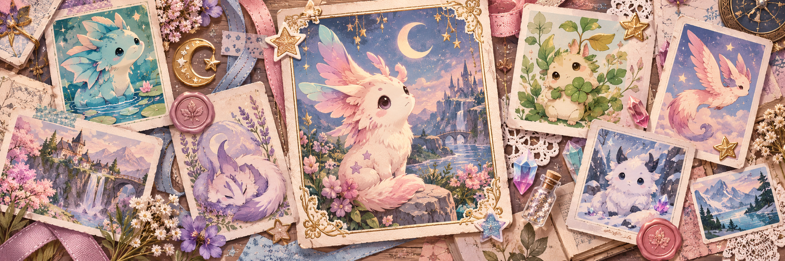

<!-- project-centered:start -->

<h1 align="center">neopets-assets</h1>

<!-- project-header:start -->

<!-- project-header:end -->

<!-- project-badges:start -->

  

<!-- project-badges:end -->

<!-- project-live-badges:start -->

  

<!-- project-live-badges:end -->

<!-- project-index:start -->

<h3 align="center">✦ Explore this project</h3>

<table align="center"><tbody><tr><td align="center" colspan="2"><a href="#readme-overview"><strong>Overview</strong></a></td></tr></tbody></table>

<h4 align="center">Project shortcuts</h4>

<table align="center"><tbody><tr><td align="center"><a href="geneticfreakme/"><strong>Image collection</strong></a></td><td align="center"><a href="readme-banner.png"><strong>Banner artwork</strong></a></td></tr></tbody></table>
<!-- project-index:end -->

<h2 align="center">Overview</h2>

Static image assets for Neopets user lookups and pet pages.

<a href="#readme-index">↑ Back to index</a> · <a href="#readme-top">Back to top ↑</a>

<!-- project-centered:end -->
